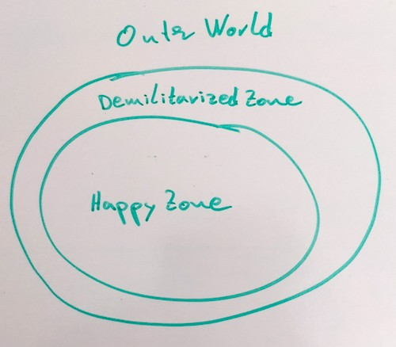

# TDD Universal Architecture Everywhere

- *Session by Tobi*
- *Notes by [@FQ400](https://twitter.com/FQ400)*

The universal architecture can be divided into three parts:

- Happy Zone
- Demilitariezed Zone
- Outer World

## Happy Zone

- everything is known and certain
- the dev can have everything tested (fast)
  - units or integration of units
- here should be most of the business logic
- never talk to to the outer world without protection
- this zone should be as big as possible

## Demilitariezed Zone

- this zone protects the happy zone
- it talks to the outer world usind defined interfaces
- testing is harder and slower
  - integration or end-2-end tests
- this zone should be as thin as possible

## Outer World

- this is out of control of the dev
- for example:
  - File sysyem (IO),
  - DOM, window/global
  - new Date
  - network (fetch)

## Disscussion and Insights

You shouldn't check in a red test for setup purpose. Everything that can be tested can also be scripted and should be automated.

A video from [J. B. Rainsberger](https://twitter.com/jbrains) [Integrated Tests Are A Scam](https://blog.thecodewhisperer.com/permalink/integrated-tests-are-a-scam).

It is a nice addition to the testing pyramid.
